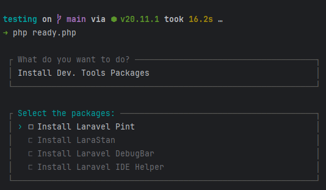

# Laravel Ready

Simple PHP script that can be used to prepare new Laravel projects very easily.

**You are ready to run the file!** Continue to the below section.

## Usage

1. Download the file by using `wget` **in the root of your project:**

```bash
wget https://raw.githubusercontent.com/bhcosta90/laravel-ready/main/ready.php
```

2. Execute the script:

```bash
php ready.php
```

**The script will be self-destructed after the execution.**

## Available Options

### Install Dev. Tools Packages:


